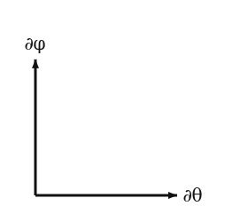

The standard chart on $S^2$:
$$\Phi(\theta, \varphi) = (\sin\theta \cos\varphi, \; \sin\theta \sin\varphi, \; \cos\theta).$$

## Basis vectors

In the embedded picture, the **coordinate basis** at the point $p = \Phi(\theta, \varphi)$ is obtained by differentiating $\Phi$ with respect to each coordinate:
$$\begin{aligned}
\partial_\theta &= \frac{\partial \Phi}{\partial \theta} = (\cos\theta\cos\varphi, \; \cos\theta\sin\varphi, \; -\sin\theta), \\[2pt]
\partial_\varphi &= \frac{\partial \Phi}{\partial \varphi} = (-\sin\theta\sin\varphi, \; \sin\theta\cos\varphi, \; 0).
\end{aligned}$$
These two vectors in $\mathbb{R}^3$ are tangent to $S^2$ at $p$ by construction, and they span $T_p S^2$.

Two facts at a glance:

- **Lengths.** $|\partial_\theta| = 1$ at every point; $|\partial_\varphi| = \sin\theta$, vanishing at the poles where the chart breaks down.
- **Inner product.** $\partial_\theta \cdot \partial_\varphi = 0$ everywhere — the standard basis is *orthogonal* at every point.

Both facts can be checked by direct computation from the formulas above. The orthogonality is what makes the standard chart so easy to compute with.

## At the sample point

Plug $\theta_0 = 13\pi/32, \varphi_0 = 29\pi/32$ into the formulas:
$$\begin{aligned}
p &\approx (-0.910, \; 0.286, \; 0.290), \\
\partial_\theta\big|_p &\approx (-0.286, \; 0.0900, \; -0.957), \\
\partial_\varphi\big|_p &\approx (-0.286, \; -0.910, \; 0).
\end{aligned}$$
Verification: $\partial_\theta \cdot \partial_\varphi = (-0.286)(-0.286) + (0.0900)(-0.910) + (-0.957)(0) = 0.0817 - 0.0819 + 0 \approx 0$ to rounding error. Orthogonality confirmed.

The tangent-plane diagram, drawn locally at $p$:

The horizontal axis represents $\partial_\theta$ direction (unit length); the vertical axis $\partial_\varphi$ direction (length $\sin\theta_0 \approx 0.981$). At the sample point's latitude they happen to be nearly the same length; near the poles the discrepancy is much larger.

## In coordinate basis

A general tangent vector at $p$ is
$$v = v^\theta\, \partial_\theta + v^\varphi\, \partial_\varphi,$$
with components $(v^\theta, v^\varphi) \in \mathbb{R}^2$. The components depend on the chart; the vector itself does not.

The chart-coordinate functions on $S^2$ are the smooth real-valued functions $\theta(p) = \arctan(\sqrt{X^2+Y^2}/Z)$ and $\varphi(p) = \arctan(Y/X)$, both defined where the chart is. Their differentials $d\theta, d\varphi$ are the **dual basis**:
$$d\theta(\partial_\theta) = 1, \quad d\theta(\partial_\varphi) = 0, \quad d\varphi(\partial_\theta) = 0, \quad d\varphi(\partial_\varphi) = 1.$$
A general covector is $\omega = \omega_\theta\, d\theta + \omega_\varphi\, d\varphi$ and the pairing with $v$ is $\omega(v) = \omega_\theta\, v^\theta + \omega_\varphi\, v^\varphi$ — just multiply matched components and sum.

## Why this chart is the "easy" one

In the standard chart, almost everything has a diagonal form:

- The metric (next section) has the diagonal matrix $g = \mathrm{diag}(1, \sin^2\theta)$.
- The basis is orthogonal, so raising and lowering indices is the same as multiplying components by $g_{\mu\mu}$ or $1/g_{\mu\mu}$.
- The Christoffel symbols (section 5) have only three non-zero entries.

The next page introduces the skew chart, which has none of these properties. The math is identical; the components are not.
