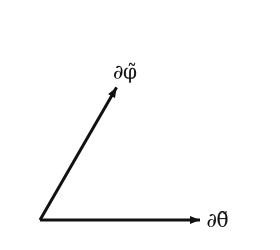
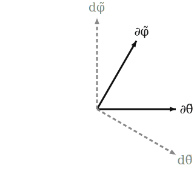

The skew chart in this book is defined so its grid is **visibly tilted** relative to the standard chart — the longitude circles are sheared, the latitude circles stay horizontal. (See [the diagram on the previous page](01-the-sphere-and-two-charts.md).) The tilt parameter is fixed throughout: $\alpha = \pi/8 \approx 22.5°$.

The simplest definition that gives that picture keeps the standard $\theta$ and shears the longitude:
$$\tilde\theta := \theta, \qquad \tilde\varphi := \varphi + \alpha\, \cos\theta.$$
The shift by $\alpha\cos\theta$ is largest at the poles and zero at the equator, producing the visible tilt of the longitude curves. The Jacobian of $(\theta, \varphi) \mapsto (\tilde\theta, \tilde\varphi)$ is everywhere non-singular ($\det = 1$), so this is a valid chart wherever the standard one is.

In the embedded picture,
$$\tilde\Phi(\tilde\theta, \tilde\varphi) = \Phi\big(\tilde\theta,\, \tilde\varphi - \alpha\cos\tilde\theta\big) = (\sin\tilde\theta\, \cos\psi,\; \sin\tilde\theta\, \sin\psi,\; \cos\tilde\theta), \quad \psi := \tilde\varphi - \alpha\cos\tilde\theta.$$

## Basis vectors

Differentiating the embedded formula:
$$\begin{aligned}
\partial_{\tilde\theta} &= \frac{\partial \tilde\Phi}{\partial \tilde\theta} = (\cos\tilde\theta\,\cos\psi + \alpha\sin^2\tilde\theta\,\sin\psi, \; \cos\tilde\theta\,\sin\psi - \alpha\sin^2\tilde\theta\,\cos\psi, \; -\sin\tilde\theta), \\
\partial_{\tilde\varphi} &= \frac{\partial \tilde\Phi}{\partial \tilde\varphi} = (-\sin\tilde\theta\,\sin\psi, \; \sin\tilde\theta\,\cos\psi, \; 0).
\end{aligned}$$

In terms of the **standard** basis vectors $\partial_\theta, \partial_\varphi$ evaluated at the same point in $S^2$, the chain rule gives
$$\partial_{\tilde\theta} = \partial_\theta + \alpha\sin\tilde\theta\, \partial_\varphi, \qquad \partial_{\tilde\varphi} = \partial_\varphi.$$

This is more compact and more informative than the embedded formula. The skew basis vector $\partial_{\tilde\varphi}$ is *the same* tangent vector as the standard $\partial_\varphi$ (because $\partial / \partial\tilde\varphi = \partial / \partial \varphi$ with $\theta$ held fixed). The skew $\partial_{\tilde\theta}$ is the standard $\partial_\theta$ *plus* a contribution along $\partial_\varphi$ proportional to $\alpha \sin\tilde\theta$. The shear scales with $\sin\theta$ — zero at the poles, maximum at the equator.

## Non-orthogonality

The inner product of the two skew basis vectors:
$$\partial_{\tilde\theta} \cdot \partial_{\tilde\varphi} = (\partial_\theta + \alpha\sin\tilde\theta\, \partial_\varphi) \cdot \partial_\varphi = \partial_\theta \cdot \partial_\varphi + \alpha\sin\tilde\theta\, |\partial_\varphi|^2 = 0 + \alpha\sin\tilde\theta \cdot \sin^2\tilde\theta = \alpha \sin^3\tilde\theta.$$
Non-zero away from the poles. This is the entry $g_{\tilde\theta\tilde\varphi}$ of the metric in the skew chart, and the most direct sign that the chart is "non-orthogonal."

The angle between the skew basis vectors:
$$\cos \angle(\partial_{\tilde\theta}, \partial_{\tilde\varphi}) = \frac{\partial_{\tilde\theta} \cdot \partial_{\tilde\varphi}}{|\partial_{\tilde\theta}|\, |\partial_{\tilde\varphi}|} = \frac{\alpha\sin^3\tilde\theta}{\sqrt{1 + \alpha^2 \sin^4 \tilde\theta} \, \cdot \sin\tilde\theta} = \frac{\alpha\sin^2\tilde\theta}{\sqrt{1 + \alpha^2 \sin^4\tilde\theta}}.$$
At $\tilde\theta = \pi/2$ (equator) and $\alpha = \pi/8$ the cosine is $\alpha/\sqrt{1+\alpha^2} \approx 0.366$, so the angle is about $69°$ — visibly off-$90°$.

## At the sample point

With $\tilde\theta_0 = \theta_0 = 13\pi/32, \tilde\varphi_0 = \varphi_0 + \alpha\cos\theta_0$:
$$|\partial_{\tilde\theta}|^2 = 1 + \alpha^2 \sin^4 \tilde\theta_0 \approx 1 + (\pi/8)^2 (0.981)^4 \approx 1.143.$$
$$|\partial_{\tilde\varphi}|^2 = \sin^2 \tilde\theta_0 \approx 0.962.$$
$$\cos \angle \approx \frac{(\pi/8)(0.981)^2}{\sqrt{1.143}} \approx 0.353,$$
so the angle is about $69.3°$.

The tangent-plane diagram in the skew chart:

The diagram exaggerates the obliqueness slightly (it's drawn at $60°$ for visual clarity), but the qualitative picture is right: the basis pair is sheared compared to the standard chart.

## Dual basis

The **dual basis** $d\tilde\theta, d\tilde\varphi$ is defined by $d\tilde\theta(\partial_{\tilde\theta}) = 1$, $d\tilde\theta(\partial_{\tilde\varphi}) = 0$, etc. In an orthogonal coordinate system, the dual basis is simply parallel to the coordinate basis (up to scaling). In a *non*-orthogonal system, it is not — each dual covector is perpendicular to the *other* coordinate axis, not to its own.

Concretely:

- $d\tilde\theta$ is perpendicular to $\partial_{\tilde\varphi}$, not to $\partial_{\tilde\theta}$.
- $d\tilde\varphi$ is perpendicular to $\partial_{\tilde\theta}$, not to $\partial_{\tilde\varphi}$.

The angle between $d\tilde\theta$ and $d\tilde\varphi$ is also not $\pi/2$ — it is the *same* angle as between $\partial_{\tilde\theta}$ and $\partial_{\tilde\varphi}$, by a symmetric argument. (Both bases lie in the same $2$-dimensional space; the chart's "shear" affects both.)

## Coordinate functions

To complete the picture: what *are* the coordinate functions $\tilde\theta, \tilde\varphi$ on $S^2$, regarded as smooth real-valued functions of points? They are
$$\tilde\theta(p) = \theta(p), \qquad \tilde\varphi(p) = \varphi(p) + \alpha\, \cos\theta(p),$$
with $\theta, \varphi$ the standard coordinate functions. These are explicit functions of position, and $d\tilde\theta, d\tilde\varphi$ are their differentials in the usual sense.

The next page works out the relation between the two charts — the Jacobian, and what it means to transform components between them.
