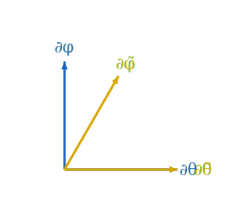

The two charts on $S^2$ describe the same surface. A vector or a function at a point has a single intrinsic identity; what changes between charts is the *components*. This page sets up the bookkeeping.

## The Jacobian

Between the two charts the transition is
$$\tilde\theta = \theta, \qquad \tilde\varphi = \varphi + \alpha \cos\theta,$$
with inverse
$$\theta = \tilde\theta, \qquad \varphi = \tilde\varphi - \alpha\cos\tilde\theta.$$
The Jacobians are
$$J = \frac{\partial(\tilde\theta, \tilde\varphi)}{\partial(\theta, \varphi)} = \begin{pmatrix} 1 & 0 \\ -\alpha\sin\theta & 1 \end{pmatrix}, \qquad J^{-1} = \frac{\partial(\theta, \varphi)}{\partial(\tilde\theta, \tilde\varphi)} = \begin{pmatrix} 1 & 0 \\ \alpha\sin\tilde\theta & 1 \end{pmatrix}.$$
Both have determinant $1$. (The shear is volume-preserving.)

## Basis vectors transform with $J^{-1}$

A coordinate basis vector $\partial_{\tilde\mu}$ at a point is the derivation $\partial/\partial \tilde{x}^\mu$. By the chain rule applied to any smooth function $f$:
$$\partial_{\tilde\theta} f = \frac{\partial \theta}{\partial \tilde\theta}\, \partial_\theta f + \frac{\partial \varphi}{\partial \tilde\theta}\, \partial_\varphi f = \partial_\theta f + \alpha\sin\tilde\theta\, \partial_\varphi f.$$
So
$$\partial_{\tilde\theta} = \partial_\theta + \alpha\sin\tilde\theta\, \partial_\varphi, \qquad \partial_{\tilde\varphi} = \partial_\varphi,$$
matching what the [previous page](03-skew-coordinates.md) derived by differentiating the embedded parametrization.

In matrix form, with column vectors of basis elements:
$$\begin{pmatrix} \partial_{\tilde\theta} \\ \partial_{\tilde\varphi} \end{pmatrix} = J^{-1} \begin{pmatrix} \partial_\theta \\ \partial_\varphi \end{pmatrix}.$$
The basis transforms with the **inverse** Jacobian. This is the defining property of a *covariant* index — moving with the basis, opposite to how vector components move.

## Components transform with $J$

A tangent vector $v$ has components $v^\mu$ in the standard chart and $\tilde v^{\tilde\mu}$ in the skew chart. The intrinsic identity
$$v = v^\theta\, \partial_\theta + v^\varphi\, \partial_\varphi = \tilde v^{\tilde\theta}\, \partial_{\tilde\theta} + \tilde v^{\tilde\varphi}\, \partial_{\tilde\varphi}$$
combined with the basis transformation above gives
$$\tilde v^{\tilde\theta} = v^\theta, \qquad \tilde v^{\tilde\varphi} = v^\varphi - \alpha\sin\theta\, v^\theta,$$
or in matrix form $\tilde v = J v$. Vector components transform with $J$, opposite to the basis — this is the *contravariant* transformation rule, and the reason vector indices are written **up**.

A covector $\omega$ pairs against $v$ to give a chart-independent number $\omega(v) = \omega_\mu v^\mu$. For that pairing to be invariant under chart change, the covector components must transform with $J^{-1}$:
$$\tilde \omega_{\tilde\theta} = \omega_\theta + \alpha\sin\theta\, \omega_\varphi, \qquad \tilde \omega_{\tilde\varphi} = \omega_\varphi.$$
This is the covariant rule — index down.

## A worked pairing

Take the function $f(p) = Z(p) = \cos\theta(p)$ (the embedded $Z$-coordinate). Its differential is the covector $df$, with standard-chart components
$$df = -\sin\theta\, d\theta + 0 \cdot d\varphi, \quad \text{so} \quad \omega_\theta = -\sin\theta, \quad \omega_\varphi = 0.$$
In the skew chart, applying the transformation rule:
$$\tilde \omega_{\tilde\theta} = -\sin\tilde\theta + \alpha\sin\tilde\theta \cdot 0 = -\sin\tilde\theta, \qquad \tilde \omega_{\tilde\varphi} = 0.$$
Same components — because $\tilde\theta = \theta$ and $f$ depends only on $\theta$. Sanity check.

Now take the vector $v = \partial_\varphi$ (rotation around the $Z$-axis). Its standard components are $(v^\theta, v^\varphi) = (0, 1)$. Skew components:
$$\tilde v^{\tilde\theta} = 0, \qquad \tilde v^{\tilde\varphi} = 1 - \alpha\sin\theta \cdot 0 = 1.$$
Identical again, because $\partial_\varphi = \partial_{\tilde\varphi}$ in our shear.

For a less trivial example, take $w = \partial_\theta$ (motion along a meridian). Standard components $(1, 0)$, skew components
$$\tilde w^{\tilde\theta} = 1, \qquad \tilde w^{\tilde\varphi} = 0 - \alpha\sin\theta \cdot 1 = -\alpha\sin\theta.$$
Now the skew chart sees a non-zero $\tilde\varphi$-component. Yet the pairing $df(w)$ is the same in both:
$$df(w) = \omega_\theta w^\theta + \omega_\varphi w^\varphi = (-\sin\theta)(1) + 0 = -\sin\theta,$$
$$df(w) = \tilde\omega_{\tilde\theta} \tilde w^{\tilde\theta} + \tilde\omega_{\tilde\varphi} \tilde w^{\tilde\varphi} = (-\sin\tilde\theta)(1) + 0 \cdot (-\alpha\sin\tilde\theta) = -\sin\tilde\theta.$$
The components changed; the number didn't.

## What's intrinsic, what's not

A summary of which quantities are intrinsic (chart-independent) and which depend on the chart:

| Quantity | Intrinsic? |
|---|---|
| The vector $v \in T_p M$ | Yes |
| The covector $\omega \in T^*_p M$ | Yes |
| Components $v^\mu$ | **No** — chart-dependent |
| Components $\omega_\mu$ | **No** — chart-dependent |
| Pairing $\omega(v) = \omega_\mu v^\mu$ | Yes |
| Coordinate basis $\partial_\mu$ at a point | **No** — chart-dependent |
| Dual coordinate basis $dx^\mu$ at a point | **No** — chart-dependent |
| Lengths, angles (when a metric is fixed) | Yes |
| Christoffel symbols $\Gamma^\rho{}_{\mu\nu}$ | **No** — not even tensorial |

The tensor calculus of the next four sections is largely a story about consistently keeping the intrinsic objects in view while computing with their chart-dependent components.
