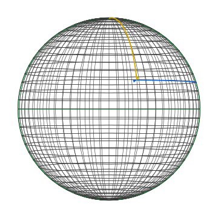
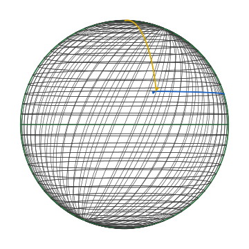

## The surface

The two-sphere of radius $R$ is the subset
$$S^2_R = \{(X, Y, Z) \in \mathbb{R}^3 : X^2 + Y^2 + Z^2 = R^2\}.$$
Throughout this book we take $R = 1$ unless stated otherwise. The sphere is a smooth two-dimensional submanifold of $\mathbb{R}^3$ — small enough to be tractable, rich enough that almost every phenomenon in tensor calculus shows up on it non-trivially.

The embedded picture is the affine tangent plane at each point. Intrinsically, the sphere is a closed orientable surface with constant curvature; the constructions of this book work intrinsically and reduce to the embedded picture wherever both apply.

## What a chart is

A **chart** on a smooth manifold $M$ is a smooth invertible map
$$\Phi: U \to V,$$
where $U \subseteq \mathbb{R}^n$ is open and $V \subseteq M$ is an open subset. The inverse $\Phi^{-1}: V \to U$ assigns coordinates to points; the components are the **coordinate functions** $x^\mu := \pi_\mu \circ \Phi^{-1}$.

A single chart almost never covers all of $M$. The sphere needs at least two — any chart that uses $\theta, \varphi$ angular coordinates has a singularity at the poles where $\varphi$ is undefined. Manifolds are described by an **atlas** of charts whose overlaps glue together smoothly (the **transition maps**).

For tensor calculus, the choice of atlas mostly doesn't matter — every object we introduce is **chart-independent** in the sense that it has an intrinsic definition. What *does* depend on the chart is the **component representation**: the array of numbers a tensor has in a given chart. The transformation rule between charts is what makes those arrays into a tensor.

## Two charts on $S^2$

We use two charts throughout the book, both parametrized by $(\theta, \varphi) \in (0, \pi) \times [0, 2\pi)$.

**Standard chart** $\Phi$. The familiar lat/long parametrization:
$$\Phi(\theta, \varphi) = (\sin\theta\cos\varphi, \; \sin\theta\sin\varphi, \; \cos\theta).$$
The "north pole" $\theta = 0$ aligns with the $+Z$ axis; the equator $\theta = \pi/2$ lies in the $XY$-plane; the prime meridian $\varphi = 0$ is the half of the $XZ$-plane with $X > 0$. The chart misses the two poles and the seam at $\varphi = 0$.

**Skew chart** $\tilde\Phi$. Take the standard parametrization, rotate it by a fixed angle $\alpha$ around the $Z$-axis applied *after* the longitude rotation:
$$\tilde\Phi(\tilde\theta, \tilde\varphi) = R_Z(\alpha) \cdot R_Y(\tilde\varphi) \cdot R_X(\tilde\theta) \cdot (R, 0, 0)$$
where $R_A(\beta)$ is rotation around axis $A$ by angle $\beta$ and the right-hand factor is the prime-meridian-equator intersection. Concretely the longitude circles are tilted from the standard meridians by $\alpha$ around $Z$ (the latitude circles are unchanged in this parametrization — they sit at constant $\theta$). In this book we fix $\alpha = \pi/8 \approx 22.5°$ for visibility.

The two diagrams show the same surface with the same equator (the green great circle at $\theta = \pi/2$). The prime meridian of each chart is the other green great circle; in the standard chart it's the front-vertical meridian, in the skew chart it's tilted.

The colored arrows mark the basis-vector directions at a fixed **sample point**
$$p = \Phi(\theta_0, \varphi_0) \quad\text{with } \theta_0 = \tfrac{13\pi}{32}, \ \varphi_0 = \tfrac{29\pi}{32}.$$
The yellow arc is along the longitude (the direction of increasing $\theta$ for the chart in question); the blue arc is along the latitude (the direction of increasing $\varphi$). In the standard chart these two arcs meet at $90°$ at every point. In the skew chart they don't — at the sample point the angle between them is visibly less than $90°$. Section [02](02-standard-coordinates.md) and [03](03-skew-coordinates.md) work out the basis vectors explicitly.

## What the contrast is meant to show

Three things become visible by comparing the charts:

1. **A choice of chart picks a basis at every point.** Each chart has its own coordinate basis $\partial_\theta, \partial_\varphi$ in the tangent space at $p$. The basis is part of the chart, not part of the manifold.
2. **The angle between basis vectors is not invariant.** It depends on the chart. Where the basis is non-orthogonal, components of the metric pick up off-diagonal entries; the dual basis is no longer parallel to the coordinate basis; and Christoffel symbols multiply.
3. **The geometry doesn't care.** The geodesics, the curvature, the area form — all are the same intrinsic objects in both charts. Their *components* differ; their intrinsic descriptions do not. This invariance is exactly what the tensor transformation law enforces.

The next pages develop these three observations concretely.
